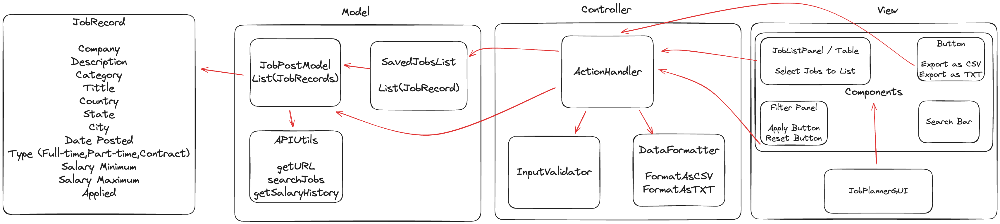
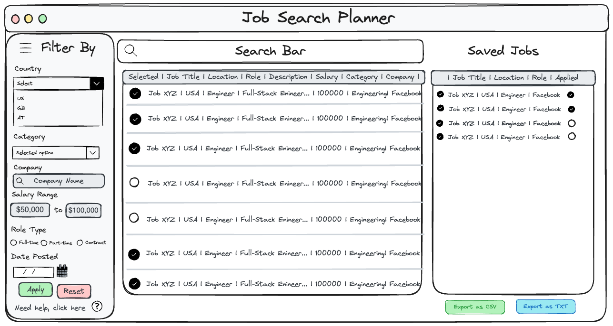
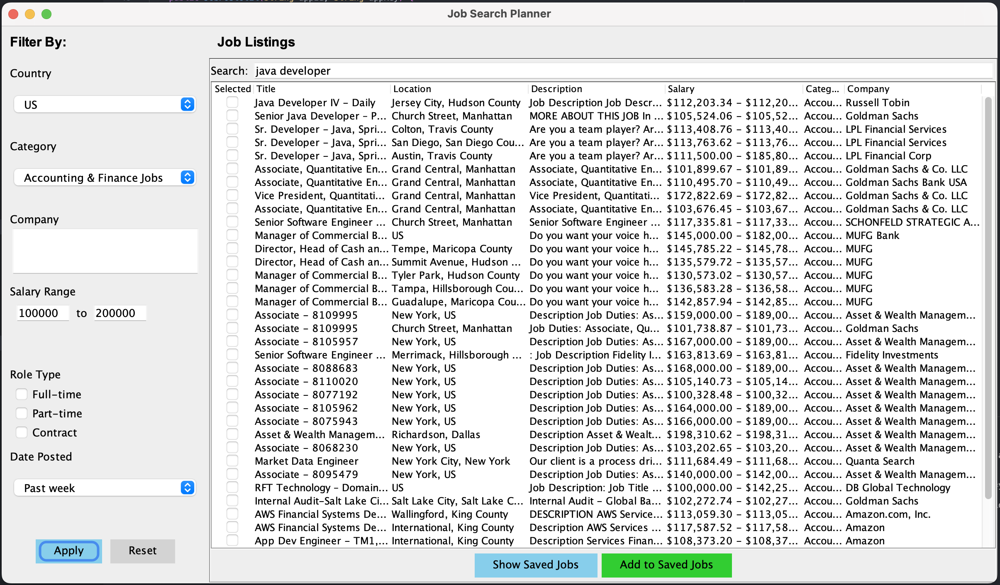
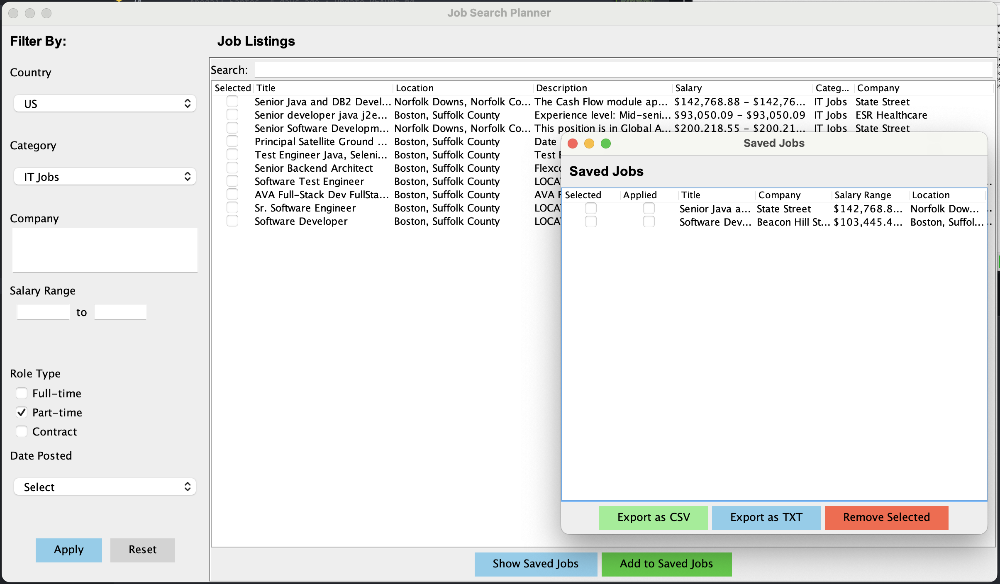

# Design Document

## UML Design

### Initial UML

### Final UML

```mermaid
classDiagram
    class JobPlannerApp {
        +CommandSpec spec
        +run()
        +main(String... args)
    }

    class JobPlannerSearch {
        +String country
        +String[] keyword
        +String location
        +String salaryMin
        +String salaryMax
        +String category
        +Formats format
        +String days
        +run()
    }

    class JobPlannerList {
        -Formats format
        -String output
        -boolean count
        +setFormat(String format)
        +run()
    }

    class JobPlannerGraphUI {
        -String file
        +run()
    }

    class JobPlannerController {
        -JobPlannerGUI view
        -ISavedJobModel savedJobsModel
        +JobPlannerController(ISavedJobModel savedJobs, JobPlannerGUI view)
        +start()
        +actionPerformed(ActionEvent e)
        -exportList(Formats format)
        +searchJobPostings(String country, Map~String, String~ searchParams) List~JobRecord~
        -search()
        -resetFilters()
        -showSavedJobs()
        -addSelectedJobsToList()
        -removeSelectedJobs()
        -parseInt(String value) Integer
        +updateJobList(List~JobRecord~ jobs)
        -writeSavedJobListToFile(List~JobRecord~ jobs)
    }

    class JobPlannerGUI {
        -FilterPanel filterPanel
        -JobListPanel jobListPanel
        -SavedJobsPanel savedJobsPanel
        +JobPlannerGUI(JobPostModel jobs, SavedJobModel savedJobs)
        +showSavedJobsPanel()
        +setListeners(ActionListener listener)
        +getFilterPanel() FilterPanel
        +getJobListPanel() JobListPanel
        +getSavedJobsPanel() SavedJobsPanel
        +showErrorDialog(String message)
    }

    class JobCategory {
        -String tag
        -String label
        +JobCategory(String tag, String label)
        +getTag() String
        +getLabel() String
        +toString() String
        +fromTag(String tag) JobCategory
        +fromLabel(String label) JobCategory
        +fromString(String value) JobCategory
        +getCategoryLabels() List~String~
    }

    class DataFormatter {
        -DataFormatter()
        +write(Collection~JobRecord~ records, Formats format, OutputStream out)
        -prettyPrint(Collection~JobRecord~ records, OutputStream out)
        -prettySingle(JobRecord record, PrintStream out)
        -writeJsonData(Collection~JobRecord~ records, OutputStream out)
        -writeCSVData(Collection~JobRecord~ records, OutputStream out)
        +convertSalary(double salary) String
    }

    class Formats {
        JSON
        CSV
        PRETTY
    }

    class ISavedJobModel {
        +FILEPATH: String
        +getLastSaved() LocalDate
        +setLastSaved(LocalDate date)
        +count() int
        +addSavedJob(JobRecord job)
        +removeSavedJob(JobRecord job)
        +getSavedJobs() List~JobRecord~
        +setSavedJobs(List~JobRecord~ jobs)
        +clearSavedJobs()
        +loadFromJson() ISavedJobModel
        +loadFromJson(String filePath) ISavedJobModel
    }

    class SavedJobModel {
        -List~JobRecord~ savedJobs
        -LocalDate lastSaved
        -SavedJobModel(List~JobRecord~ savedJobs)
        +getLastSaved() LocalDate
        +setLastSaved(LocalDate date)
        +getSavedJobs() List~JobRecord~
        +setSavedJobs(List~JobRecord~ jobs)
        +addSavedJob(JobRecord job)
        +removeSavedJob(JobRecord job)
        +clearSavedJobs()
        +count() int
        +loadFromJson() ISavedJobModel
        +loadFromJson(String filePath) ISavedJobModel
    }

    class JobPostModel {
        -List~JobRecord~ jobs
        -JobPostModel(List~JobRecord~ jobs)
        +getJobs() List~JobRecord~
        +getInstance() IJobPostModel
        +getInstance(String database) IJobPostModel
    }

    class IJobPostModel {
        +DATABASE: String
        +getJobs() List~JobRecord~
        +writeRecords(List~JobRecord~ records, Formats format, OutputStream out)
        +getInstance() IJobPostModel
        +getInstance(String database) IJobPostModel
        +JobRecord
        +Category
        +Company
        +Location
    }

    class JobPostUtil {
        -String appId
        -String appKey
        +JobPostUtil(String appId, String appKey)
        -getBaseUrl(String country, String endpoint, String pages) String
        -buildQueryString(String endpoint, String country, Map~String, String~ params) String
        +getJobPostings() InputStream
        +getJobPostings(String country) InputStream
        +getJobPostings(Map~String, String~ params) InputStream
        +getJobPostings(String country, Map~String, String~ params) InputStream
        +getJobPostingList(String country, Map~String, String~ params) List~JobRecord~
        +getUrlContents(String urlStr) InputStream
        +main(String[] args)
    }

    class SavedJobsPanel {
        -JTable savedJobTable
        -SavedJobTableModel savedJobTableModel
        -JButton exportCsvButton
        -JButton exportTxtButton
        -JButton removeButton
        +SavedJobsPanel(SavedJobTableModel savedJobTableModel)
        +getSavedJobTable() JTable
        +getSavedJobTableModel() SavedJobTableModel
        +setListeners(ActionListener listener)
        -initializeUIComponents()
        -initializeHeaderLabel()
        -initializeSavedJobTable()
        -initializeButtonPanel()
    }

    class JobListPanel {
        -JTable jobTable
        -JobTableModel jobTableModel
        -JTextField searchBar
        -JButton showSavedJobsButton
        -JButton addSavedJobsButton
        +JobListPanel(JobTableModel jobTableModel)
        +getJobTable() JTable
        +getJobTableModel() JobTableModel
        +getSearchText() String
        +getShowSavedJobsButton() JButton
        +getAddSavedJobsButton() JButton
        +setListeners(ActionListener listener)
        -initializeUIComponents()
        -initializeSearchPanel()
        -initializeJobTable()
        -initializeButtonPanel()
        -adjustCategoryColumnWidth()
        -showJobDetails(JobRecord job)
    }

    class FilterPanel {
        -JComboBox~String~ countryComboBox
        -JComboBox~String~ categoryComboBox
        -JTextField companyTextField
        -JTextField minSalaryField
        -JTextField maxSalaryField
        -JCheckBox fullTimeCheckBox
        -JCheckBox partTimeCheckBox
        -JCheckBox contractCheckBox
        -JComboBox~String~ datePostedComboBox
        -JButton applyFilterButton
        -JButton resetFilterButton
        +FilterPanel()
        -initializeFilterComponents()
        -initializeButtonPanel()
        -createLabeledComboBox(String labelText, JComboBox~String~ comboBox) JPanel
        -createLabeledTextField(String labelText, JTextField textField) JPanel
        -createLabeledSalaryRange(String labelText, JTextField minField, JTextField maxField) JPanel
        -createRoleTypePanel() JPanel
        +reset()
        +getSelectedCountry() String
        +getSelectedCategory() String
        +getCompany() String
        +getMinSalary() String
        +getMaxSalary() String
        +getSelectedRoleTypes() List~String~
        +getDateFilter() String
        +getApplyFilterButton() JButton
        +getResetFilterButton() JButton
        +setListeners(ActionListener listener)
    }

    class AbstractJobTableModel {
        -List~JobRecord~ jobs
        -List~Boolean~ selected
        -String[] columnNames
        +AbstractJobTableModel(List~JobRecord~ jobs, String[] columnNames)
        +getRowCount() int
        +getColumnCount() int
        +getColumnName(int column) String
        +isCellEditable(int rowIndex, int columnIndex) boolean
        +setValueAt(Object aValue, int rowIndex, int columnIndex)
        +getColumnClass(int columnIndex) Class<?>
        +getSelectedJobs() List~JobRecord~
        +getJobAt(int rowIndex) JobRecord
        +setJobs(List~JobRecord~ jobs)
        -convertSalary(double salary) String
    }

    class SavedJobTableModel {
        -List~Boolean~ applied
        +SavedJobTableModel(List~JobRecord~ jobs)
        +getValueAt(int rowIndex, int columnIndex) Object
        +setValueAt(Object aValue, int rowIndex, int columnIndex)
        +isCellEditable(int rowIndex, int columnIndex) boolean
        +getColumnClass(int columnIndex) Class<?>
        +getAppliedJobs() List~JobRecord~
        +setJobs(List~JobRecord~ jobs)
    }

    class JobTableModel {
        +JobTableModel(List~JobRecord~ jobs)
        +getValueAt(int rowIndex, int columnIndex) Object
        +isCellEditable(int rowIndex, int columnIndex) boolean
        +getColumnClass(int columnIndex) Class<?>
        +getJobAt(int rowIndex) JobRecord
    }

    class JobRecord {
        +String title
        +String company
        +String location
        +String salary
        +String description
        +String category
        +String type
        +String datePosted
        +String url
        +getTitle() String
        +getCompany() String
        +getLocation() String
        +getSalary() String
        +getDescription() String
        +getCategory() String
        +getType() String
        +getDatePosted() String
        +getUrl() String
    }

    JobPlannerApp --> JobPlannerSearch
    JobPlannerApp --> JobPlannerList
    JobPlannerApp --> JobPlannerGraphUI
    JobPlannerApp --> JobPlannerController
    JobPlannerApp --> JobPlannerGUI
    JobPlannerController --> JobPlannerGUI
    JobPlannerController --> ISavedJobModel
    JobPlannerGUI --> FilterPanel
    JobPlannerGUI --> JobListPanel
    JobPlannerGUI --> SavedJobsPanel
    FilterPanel --> JobPlannerController
    JobListPanel --> JobPlannerController
    SavedJobsPanel --> JobPlannerController
    JobPlannerSearch --> JobPostUtil
    JobPostUtil --> IJobPostModel
    IJobPostModel --> JobPostModel
    IJobPostModel --> JobCategory
    IJobPostModel --> JobRecord
    JobPostModel --> JobRecord
    DataFormatter --> Formats
    DataFormatter --> JobRecord
    SavedJobModel --> JobRecord
    ISavedJobModel --> JobRecord
    JobTableModel --> JobRecord
    SavedJobTableModel --> JobRecord
    AbstractJobTableModel --> JobRecord
    JobListPanel --> JobTableModel
    SavedJobsPanel --> SavedJobTableModel
    JobPlannerController --> DataFormatter
    JobPlannerController --> JobPostUtil

```

## GUI Design

### Initial GUI Design

### Final GUI Design

