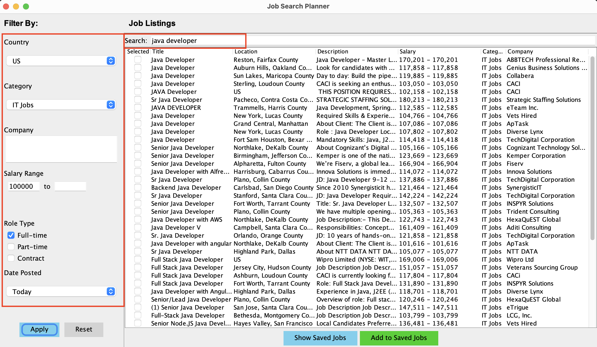
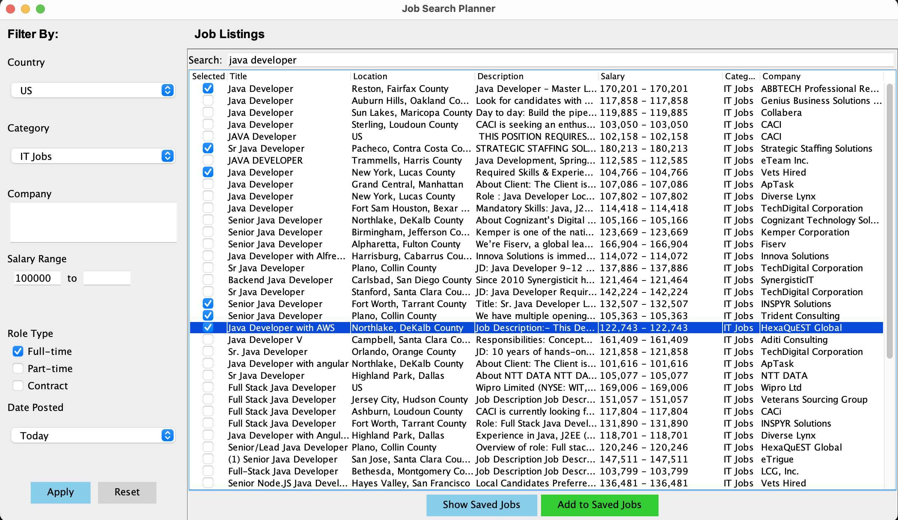
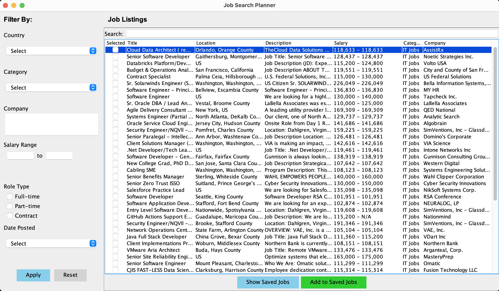

# GUI Testing History

## Table of Contents
1. [Functionality](#functionality)
    - [Filtering Jobs](#filtering-jobs)
    - [Viewing Job Descriptions](#viewing-job-description)
    - [Resetting Filters](#resetting-filters)
    - [Saving Jobs](#saving-jobs)
    - [Removing Jobs](#removing-jobs)
    - [Exporting Jobs to File](#exporting-jobs-to-file)
      - [Error Handling](#error-handling)
2. [Design](#design)
   - [Layout and Components](#layout-and-components)

## Functionality

### Filtering Jobs

1. Search bar should filter jobs by matching keywords in title and description.

   

2. Country dropdown values should show relevant countries.

   

3. Choosing "GB" from the Country dropdown and clicking the "Apply" button afterward should filter jobs available in the specified country.

   

3. Category dropdown values should show relevant job categories.

   

4. Choosing "Sales jobs" from the Category dropdown and clicking the "Apply" button afterward should filter jobs by the specified category.

   

5. Entered keywords in the company filter and clicking the "Apply" button afterward should filter jobs posted by company names containing the specified keywords.
  
   

6. Entering a salary range and clicking the "Apply" button afterward should filter jobs by the specified salary range.
   
   

7. Entering a minimum salary and clicking the "Apply" button afterward should display jobs with salaries equal to or higher than the specified salary.

   

8. Entering a maximum salary and clicking the "Apply" button afterward should display jobs with salaries equal to or lower than the specified salary.

   

9. Entering multiple filters should filter down jobs.

   

### Viewing Job Description
1. If the user double-clicks on a job, a window displaying the job details should pop up.
   
   

### Resetting Filters

1. Clicking the "Reset" button should clear the filters and display the initially loaded jobs.
   
   

### Saving Jobs

1. Users should be able to save the jobs by selecting the jobs and clicking "Add to Saved Jobs" button

   

2. If the "Show Saved Jobs" button is clicked, a new window should open up, displaying the saved jobs.

   

### Removing Jobs

1. Users should be able to remove specific jobs from the list of saved jobs by selecting the jobs to remove and clicking the "Remove Selected" button.
   
   

### Exporting Jobs to File

1. Users should be able to choose the directory to save the file in by clicking "Export as CSV" or "Export as TXT" buttons.

   

2. Users should be able to see the saved TXT or CSV file in the chosen directory after hitting save.

   

_Sample of TXT output:_

   

_Sample of CSV output:_

   

#### Error Handling

If the user types in an invalid file extension when exporting the file, the view should display an error message.

   

**Note**: Any file extensions besides ".txt" or ".csv" are considered invalid, including no extension.

## Design

### Layout and Components

1. The UI should be easy to navigate and the elements should be padded to avoid crowding.
2. The buttons should be colored. 
3. The section header fonts should be large enough to separate the different panels. 

   

   

